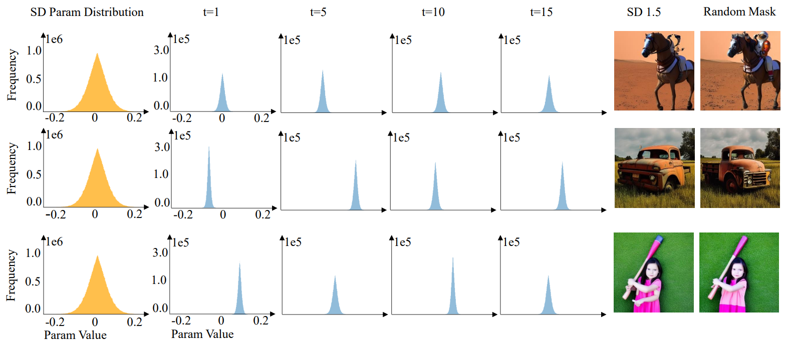
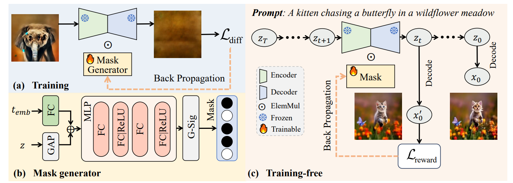
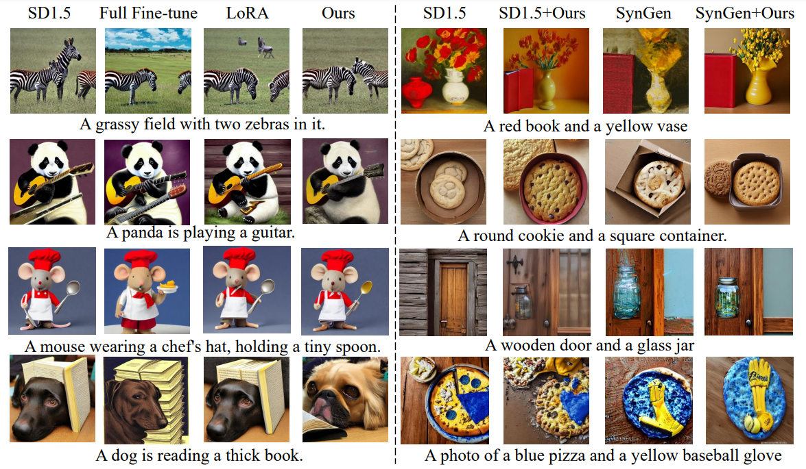
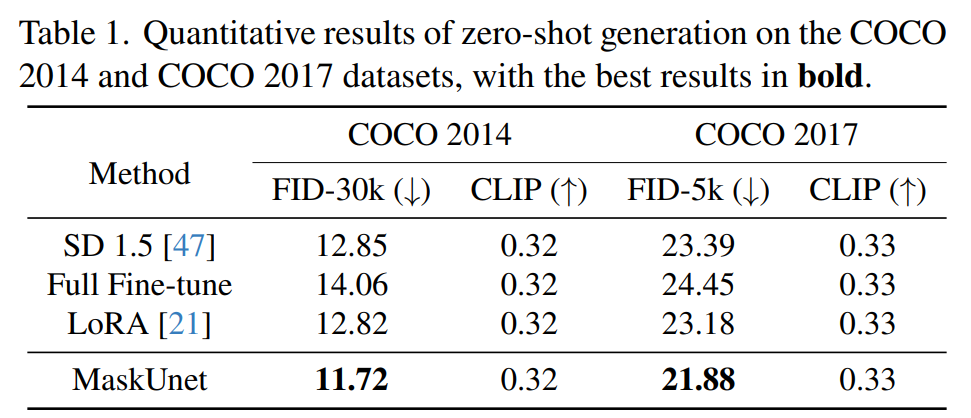

# 🚀 [CVPR 2025] [Not All Parameters Matter: Masking Diffusion Models for Enhancing Generation Ability](https://arxiv.org/pdf/2505.03097)

<div align="center">

  <br>
  <em>
      Analysis of parameter distributions and denoising effects across different time steps for Stable Diffusion (SD) 1.5 with and without random masking. The first column shows the parameter distribution of SD 1.5, while the second to fifth columns display the distributions of parameters removed by the random mask. The last two columns compare the generated samples from SD 1.5 and the random mask.
  </em>
</div>

## 📘 Introduction
The diffusion models, in early stages focus on constructing basic image structures, while the refined details, including local features and textures, are generated in later stages.  Thus the same network layers are forced to learn both structural and textural information simultaneously,  significantly differing from the traditional deep learning architectures (e.g., ResNet or GANs) which  captures or generates the image semantic information at different layers.  This difference inspires us to explore the time-wise diffusion models.  We initially investigate the key contributions of the U-Net parameters to the denoising process and identify that properly zeroing out certain parameters (including large parameters) contributes to denoising, substantially improving the generation quality on the fly. Capitalizing on this discovery, we propose a simple yet effective method—termed “MaskUNet”— that enhances generation quality with   negligible parameter numbers. Our method fully leverages timestep- and sample-dependent effective U-Net parameters. To optimize MaskUNet,  we offer two fine-tuning strategies: a training-based approach and a training-free approach, including tailored networks and optimization functions.  In zero-shot inference on the COCO dataset, MaskUNet achieves the best FID score and further demonstrates its effectiveness in downstream task evaluations.



<div align="center">
<em>The pipeline of the MaskUnet. G-Sig represents the Gumbel-Sigmoid activate function. GAP is global average pooling.
  </em>
</div>

## Training
### Datasets
fantasyfish/laion-art [link1](https://huggingface.co/datasets/fantasyfish/laion-art)  [link2](https://hf-mirror.com/datasets/fantasyfish/laion-art)

### Installation
```shell
conda env create -f environment.yaml
  ```
### Training-based
```shell
./training/infer_sd1-5_hardmask.sh
  ```

### Training-free
```shell
./training-free/infer_sd1-5_x0_optim_mask_fnal_para.sh
  ```
## ✨ Qualitative results

<div align="center">
    <b>
            Quality results compared to other methods.
    </b>
</div>


## 📈  Quantitative results
<p align="center">
 
</p>

## Citation

```
@article{wang2025not,
  title={Not All Parameters Matter: Masking Diffusion Models for Enhancing Generation Ability},
  author={Wang, Lei and Li, Senmao and Yang, Fei and Wang, Jianye and Zhang, Ziheng and Liu, Yuhan and Wang, Yaxing and Yang, Jian},
  journal={arXiv preprint arXiv:2505.03097},
  year={2025}
}

```
## Acknowledgement

This project is based on [Diffusers](https://github.com/huggingface/diffusers). Thanks for their awesome works.
### Contact
If you have any questions, please feel free to reach out to me at  `scitop1998@gmail.com`. 
