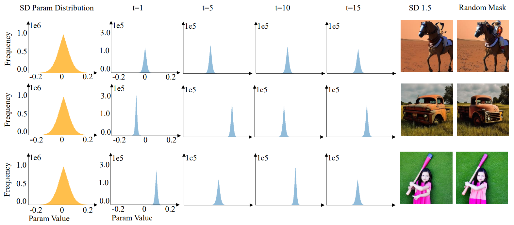
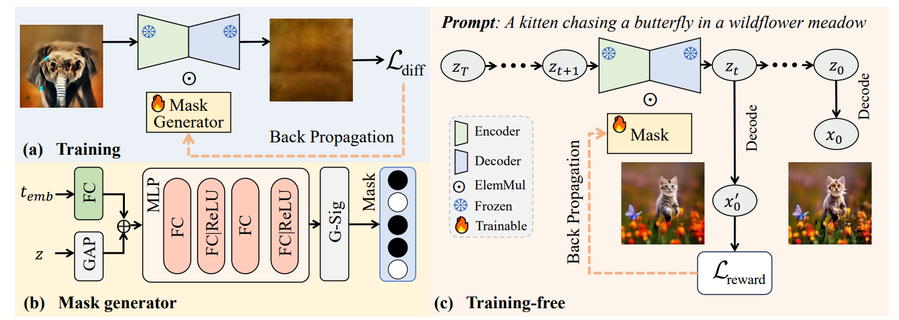
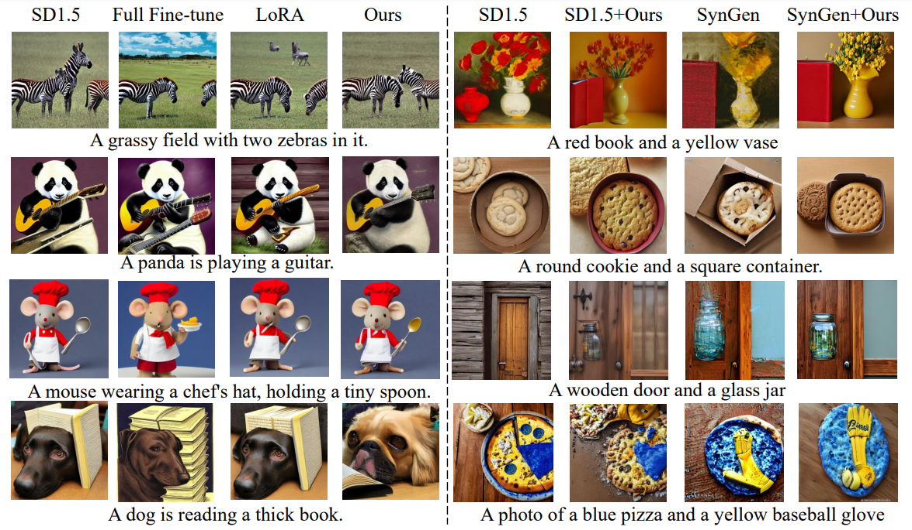
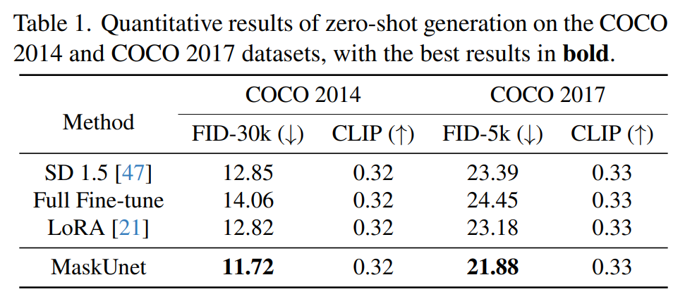

# 🚀 MaskUnet: Not All Parameters Matter for Enhancing Diffusion Generation

<h5 align="center"> If you like our project, please give us a star ⭐ on GitHub for the latest update.  </h2>

<h3 align="center">CVPR 2025</h3>


[](https://arxiv.org/abs/2505.03097) [](https://arxiv.org/pdf/2505.03097)  [](https://blog.csdn.net/wl1780852311/article/details/148223439?ops_request_misc=elastic_search_misc&request_id=164b4a527a9315755292f5b82dc8a502&biz_id=0&utm_medium=distribute.pc_search_result.none-task-blog-2~all~ElasticSearch~search_v2-1-148223439-null-null.nonecase&utm_term=maskunet&spm=1018.2226.3001.4450) [](https://zhuanlan.zhihu.com/p/1910288337698296472) [](https://mp.weixin.qq.com/s/eMqJdXly8_Sb-wtqEg-Zxw)

## 🔥 Highlights

- **A surprising finding:** masking a subset of U-Net parameters can **improve** diffusion generation quality.
- We propose **MaskUnet**, a simple yet effective method that leverages **timestep- and sample-dependent effective parameters**.
- Supports both:
  - **Training-based** optimization
  - **Training-free** optimization
- Achieves strong performance on **COCO** and downstream tasks with **negligible additional parameters**.

---

## 🖼️ Motivation

<div align="center">

<br>
<em>
Analysis of parameter distributions and denoising effects across different timesteps for Stable Diffusion 1.5 with and without random masking.
The first column shows the parameter distribution of SD 1.5; the second to fifth columns show the distributions of removed parameters under random masking.
The last two columns compare generated samples from SD 1.5 and the random mask.
</em>
</div>

---

## 📘 Overview

Diffusion models gradually generate images from coarse structure to fine details across timesteps. However, standard U-Nets use the same parameters throughout the whole denoising process, forcing them to handle both structural and textural information simultaneously.

This motivates us to study **time-wise effective parameters** in diffusion models.

We find that **properly masking certain U-Net parameters—including large-magnitude ones—can actually help denoising and improve generation quality on the fly**. Based on this observation, we propose **MaskUnet**, a lightweight method that dynamically exploits timestep- and sample-dependent effective parameters.

To optimize MaskUnet, we provide two practical settings:

- **Training-based MaskUnet**
- **Training-free MaskUnet**

MaskUnet achieves strong zero-shot generation performance on **COCO** and also generalizes well to downstream tasks.

---

## 🧠 Method

<div align="center">

<br>
<em>
Pipeline of MaskUnet. G-Sig denotes the Gumbel-Sigmoid activation function. GAP denotes global average pooling.
</em>
</div>

---

## ✨ Qualitative Results

<div align="center">
  <b>Qualitative comparison with existing methods.</b>
</div>

<div align="center">
  
</div>

---

## 📈 Quantitative Results

<p align="center">
  
</p>

---

## ⚡ Quick Start

### Installation

```bash
conda env create -f environment.yaml
conda activate maskunet
```

### Dataset

- `fantasyfish/laion-art`
  - [Hugging Face](https://huggingface.co/datasets/fantasyfish/laion-art)
  - [HF Mirror](https://hf-mirror.com/datasets/fantasyfish/laion-art)

---

## 🏋️ Training-based MaskUnet

### Train

```bash
bash ./training/train_hyperunet.sh
```

### Inference

```bash
bash ./training/infer_sd1-5_hardmask.sh
```

---

## 🎬 Training-free MaskUnet

```bash
bash ./training-free/infer_sd1-5_x0_optim_mask_fnal_para.sh
```

---

## 📌 Notes

- The training-based version learns a masking strategy through optimization.
- The training-free version directly performs mask optimization at inference time.
- Both settings are built upon **Stable Diffusion 1.5**.

---

## 📚 Citation

If you find this project useful, please consider giving it a **star** ⭐ and citing our paper.

```bibtex
@inproceedings{wang2025not,
  title={Not All Parameters Matter: Masking Diffusion Models for Enhancing Generation Ability},
  author={Wang, Lei and Li, Senmao and Yang, Fei and Wang, Jianye and Zhang, Ziheng and Liu, Yuhan and Wang, Yaxing and Yang, Jian},
  booktitle={Proceedings of the Computer Vision and Pattern Recognition Conference},
  pages={12880--12890},
  year={2025}
}
```

---

## 🙏 Acknowledgement

This project is based on [Diffusers](https://github.com/huggingface/diffusers).  
Thanks to the Diffusers team for their awesome work.

---

## 📮 Contact

If you have any questions, please feel free to reach out to:

`scitop1998@gmail.com`
